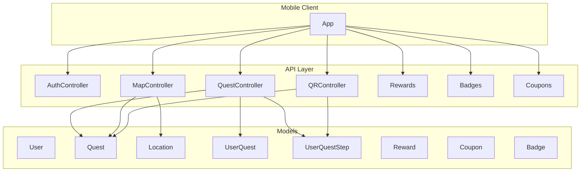

# CampusGo Mobile API Implementation Plan

## Current state

- **Auth:** [routes/api.php](z:\School\XAMPP\htdocs\CampusGoWeb\routes\api.php) exposes login (username only), register (student-only with student_id/name/birthday), logout, GET /user. Only [AuthController](z:\School\XAMPP\htdocs\CampusGoWeb\app\Http\Controllers\Api\AuthController.php) exists under `App\Http\Controllers\Api`.
- **Models:** Only [User](z:\School\XAMPP\htdocs\CampusGoWeb\app\Models\User.php) and [Student](z:\School\XAMPP\htdocs\CampusGoWeb\app\Models\Student.php). No Quest, Location, Reward, Coupon, Badge, or tracking models.
- **DB:** Migrations already define tables: users, students, locations, quests, quest_steps, user_quests, user_quest_steps, rewards, quest_rewards, coupons, user_coupons, badges, user_badges. Schema aligns with your spec (quest_type, is_repeatable, current_step, completed_at, etc.).

---

## Architecture overview

---

## Phase 1: Foundation (models and auth tweaks)

### 1.1 Eloquent models

Add models under `app/Models/` with fillable, casts, and relationships matching existing migrations:

| Model             | Table            | Key relations                                                                                                                                              |
| ----------------- | ---------------- | ---------------------------------------------------------------------------------------------------------------------------------------------------------- |
| **Location**      | locations        | —                                                                                                                                                          |
| **Quest**         | quests           | belongsTo(User as createdBy), belongsTo(Location), hasMany(QuestStep), hasMany(UserQuest), hasMany(UserQuestStep), belongsToMany(Reward via quest_rewards) |
| **QuestStep**     | quest_steps      | belongsTo(Quest)                                                                                                                                           |
| **UserQuest**     | user_quests      | belongsTo(User), belongsTo(Quest)                                                                                                                          |
| **UserQuestStep** | user_quest_steps | belongsTo(User), belongsTo(Quest), belongsTo(QuestStep)                                                                                                    |
| **Reward**        | rewards          | belongsToMany(Quest via quest_rewards)                                                                                                                     |
| **Coupon**        | coupons          | hasMany(UserCoupon)                                                                                                                                        |
| **Badge**         | badges           | hasMany(UserBadge)                                                                                                                                         |
| **UserCoupon**    | user_coupons     | belongsTo(User), belongsTo(Coupon)                                                                                                                         |
| **UserBadge**     | user_badges      | belongsTo(User), belongsTo(Badge)                                                                                                                          |

User: add `hasMany(UserQuest)`, `hasMany(UserQuestStep)`, `hasMany(UserCoupon)`, `hasMany(UserBadge)`.  
Student: no change.

### 1.2 Auth API adjustments (Critical)

- **Login by email or username:** In [AuthController::login](z:\School\XAMPP\htdocs\CampusGoWeb\app\Http\Controllers\Api\AuthController.php), accept a single field (e.g. `login` or keep `username`) and resolve user by `email` or `username` (e.g. `User::where('email', $v)->orWhere('username', $v)->first()`). Document in [docs/API_AUTH.md](z:\School\XAMPP\htdocs\CampusGoWeb\docs\API_AUTH.md).
- **Optional “set password” (pre-provisioned registration):** If you want “change password to register” for pre-provisioned accounts, add a protected endpoint e.g. `POST /api/account/set-password` (current_password, password, password_confirmation) that allows a user with a temporary/null password to set a real password once. Alternatively keep current register flow (create user + link student) as the only registration path; clarify product choice before implementing.

---

## Phase 2: Quest system APIs (Critical)

### 2.1 Quest controller and routes

**Controller:** `App\Http\Controllers\Api\QuestController` (auth:sanctum for all except listing if you want public quest list).

| Method | Endpoint                                                 | Purpose                                                                                                                                                                                                                                                                                |
| ------ | -------------------------------------------------------- | -------------------------------------------------------------------------------------------------------------------------------------------------------------------------------------------------------------------------------------------------------------------------------------- |
| GET    | `/api/quests`                                            | List quests. Query: `type` (daily, event, task), `near` (lat,lng,radius_km optional), `available_to_user` (1 = only ones user can still accept). Return id, title, description, quest_type, required_steps, is_repeatable, difficulty, location (id, name, lat, lng), rewards summary. |
| GET    | `/api/quests/{id}`                                       | Single quest with steps (ordered by step_order) and rewards.                                                                                                                                                                                                                           |
| POST   | `/api/quests/{id}/accept`                                | Create UserQuest (user_id, quest_id, current_step=0). Reject if already active or completed and quest not is_repeatable.                                                                                                                                                               |
| GET    | `/api/user/quests`                                       | Current user’s UserQuests (active and completed) with quest details and current_step.                                                                                                                                                                                                  |
| POST   | `/api/user/quests/{userQuestId}/steps/{stepId}/complete` | Mark step complete: upsert UserQuestStep (status=completed, completed_at), increment UserQuest.current_step; if current_step >= required_steps, set UserQuest.completed + completed_at and **grant rewards** (see Phase 5).                                                            |
| POST   | `/api/quests`                                            | (Taskmasters only) Create quest (task type). Body: title, description, required_steps, location_id (optional), is_repeatable, difficulty, step descriptions, reward_ids. Create Quest + QuestSteps + QuestRewards. Guard by `user->is_gamemaster`.                                     |

Implement “available to user” by excluding quests the user already has an active or completed UserQuest for, unless the quest is is_repeatable (then allow new UserQuest after previous completed).

---

## Phase 3: Map and POI APIs (High)

### 3.1 Map / POI controller

**Controller:** `App\Http\Controllers\Api\MapController` or `LocationController`.

| Method | Endpoint              | Purpose                                                                                                                                                                                                                       |
| ------ | --------------------- | ----------------------------------------------------------------------------------------------------------------------------------------------------------------------------------------------------------------------------- |
| GET    | `/api/locations`      | List locations. Query: `near` (lat, lng, radius_km) to filter by proximity. Return id, name, description, latitude, longitude, radius_meters.                                                                                 |
| GET    | `/api/locations/{id}` | Single location.                                                                                                                                                                                                              |
| GET    | `/api/map/pois`       | POIs for map: locations + quests that have a location_id. Query: `lat`, `lng`, `radius_km`. Return locations and for each location list quest ids (or quest summary) that use it, so the app can show “quest available here”. |

Proximity: use raw SQL or a simple distance formula (e.g. Haversine or flat Euclidean with scale) in a scope or query. No Google API on backend; mobile uses Google for GPS and sends lat/lng to these endpoints.

---

## Phase 4: QR verification (Medium)

### 4.1 QR generation and verification

**Controller:** `App\Http\Controllers\Api\QRController` or extend QuestController.

- **Generate QR for task/step (taskmaster):**  
  - Option A: QR payload is a signed token (e.g. JWT or signed URL) containing `quest_id`, `step_id` (or quest only for single-step), expiry.  
  - Option B: QR payload is a short code stored in DB (e.g. `qr_codes` table: code, quest_id, step_id, created_by_user_id, expires_at).  
  - Endpoint: `GET /api/quests/{id}/steps/{stepId}/qr` or `POST /api/quests/{id}/qr` (taskmaster only). Response: payload string or image URL for mobile to render as QR.
- **Verify QR (student):**  
  - Endpoint: `POST /api/verify-qr` body: `{ "payload": "..." }` (or `code` if using DB codes).  
  - Validate signature or look up code; ensure not expired.  
  - Find UserQuest for current user and this quest; ensure step exists and order matches (user’s current_step + 1 or allow completing any not-yet-completed step).  
  - Create/update UserQuestStep (status=completed, completed_at), advance UserQuest.current_step, and if quest complete run same reward-grant logic as Phase 2. Return success + updated progress.

Store QR secrets in `.env` (e.g. `QR_SIGNING_KEY`) for signed payloads; or add migration for `qr_codes` if using DB codes.

---

## Phase 5: Rewards, XP, and level (Medium)

### 5.1 Reward application (internal)

When a quest is completed (all steps done), in one place (e.g. a service or inline in QuestController):

1. Load quest’s rewards via `quest_rewards` → `rewards`.
2. For each reward:
  - **xp:** Add `amount` to `user->xp`; optionally recalc level (e.g. level = floor(xp / 100) + 1 or a levels table) and update `user->level`.  
  - **badge:** Create UserBadge (user_id, badge_id, received_at); badge_id = reward.reference_id.  
  - **coupon:** Check coupon quantity/expiry; create UserCoupon (user_id, coupon_id, redeemed=false); decrement coupon quantity if you track it.
3. Use DB transaction so progress and rewards stay consistent.

### 5.2 User progress API

Extend `GET /api/user` or add `GET /api/user/profile` to include `level`, `xp`, and optionally next-level threshold. Or keep level/xp in existing `/api/user` response (already on User model).

---

## Phase 6: Badges (Low) and Coupons (Medium)

### 6.1 Badges

**Controller:** `App\Http\Controllers\Api\BadgeController` or under a generic `ProfileController`.

| Method | Endpoint           | Purpose                                                       |
| ------ | ------------------ | ------------------------------------------------------------- |
| GET    | `/api/badges`      | List all badges (id, name, description, xp_reward).           |
| GET    | `/api/user/badges` | Current user’s UserBadges with badge details and received_at. |

Badges are primarily awarded internally when applying rewards; no public “award badge” endpoint unless needed for admin.

### 6.2 Coupons

**Controller:** `App\Http\Controllers\Api\CouponController`.

| Method | Endpoint                                  | Purpose                                                                                                                                   |
| ------ | ----------------------------------------- | ----------------------------------------------------------------------------------------------------------------------------------------- |
| GET    | `/api/user/coupons`                       | Current user’s UserCoupons (coupon code, description, type, redeemed, redeemed_at).                                                       |
| POST   | `/api/user/coupons/{userCouponId}/redeem` | Set redeemed=true, redeemed_at=now. Idempotent if already redeemed. Optionally require a “redemption code” from merchant if needed later. |

Listing “all coupons” (catalog) only if product needs it; otherwise users only see coupons they have (user_coupons).

---

## Phase 7: AR and extras (Critical for experience, low backend scope)

- **AR:** No new table required initially. AR content/triggers can be driven by **locations** (e.g. “show AR at this lat/lng”) or by **quest steps** (e.g. step description or metadata: “Find AR object at Library”). Optional: add `ar_asset_url` or `ar_metadata` (JSON) to locations or quest_steps in a later migration if needed. API: reuse GET location/quest/step; no separate “AR controller” unless you add AR-specific assets later.
- **Google API:** Used on the mobile client for GPS and maps. Backend only receives lat/lng and returns POIs/quests; no server-side Google API key required for the above.

---

## Implementation order (recommended)

1. **Phase 1:** Add all Eloquent models and relations; extend login to email/username.
2. **Phase 2:** Quest APIs (list, show, accept, complete step, complete quest, create task).
3. **Phase 5 (reward logic):** Implement “grant rewards on quest completion” and call it from step-complete and QR verify.
4. **Phase 3:** Map/POI (locations, proximity, POIs with quests).
5. **Phase 4:** QR (generate + verify).
6. **Phase 6:** Badge and coupon read/redeem endpoints.
7. **Phase 7:** Any AR-related fields or endpoints if needed.

---

## Files to add or touch

| Area           | New/updated files                                                                                                                                                                                       |
| -------------- | ------------------------------------------------------------------------------------------------------------------------------------------------------------------------------------------------------- |
| Models         | `app/Models/Location.php`, `Quest.php`, `QuestStep.php`, `UserQuest.php`, `UserQuestStep.php`, `Reward.php`, `Coupon.php`, `Badge.php`, `UserCoupon.php`, `UserBadge.php`; update `User.php` relations. |
| Auth           | [AuthController.php](z:\School\XAMPP\htdocs\CampusGoWeb\app\Http\Controllers\Api\AuthController.php) (login by email/username); optional set-password action + route.                                   |
| Quests         | `app/Http/Controllers/Api/QuestController.php`, routes in [api.php](z:\School\XAMPP\htdocs\CampusGoWeb\routes\api.php).                                                                                 |
| Map            | `app/Http/Controllers/Api/MapController.php` or `LocationController.php`, routes.                                                                                                                       |
| QR             | `app/Http/Controllers/Api/QRController.php` (or under Quest), routes; optional migration + model for qr_codes; env key for signing.                                                                     |
| Rewards        | Inline or `app/Services/QuestRewardService.php` used by QuestController and QR verify.                                                                                                                  |
| Badges/Coupons | `app/Http/Controllers/Api/BadgeController.php`, `CouponController.php` (or combined Profile/Rewards controller), routes.                                                                                |
| Docs           | Update [docs/API_AUTH.md](z:\School\XAMPP\htdocs\CampusGoWeb\docs\API_AUTH.md) and add e.g. `docs/API_QUESTS.md`, `docs/API_MAP.md`, etc., or one `docs/API_REFERENCE.md`.                              |

---

## Clarifications before implementation

1. **Registration:** Keep current “register with student_id + name + birthday” only, or add “set password for pre-provisioned account” (no new user creation)?
2. **Login field name:** Keep request field as `username` but accept email or username value, or add a separate `email` field and support both in docs?
3. **QR storage:** Prefer signed tokens (no DB) or DB-backed codes for audit/revocation?
4. **Level formula:** Fixed (e.g. level = 1 + floor(xp / 100)) or configurable (e.g. levels table with xp_threshold per level)?

