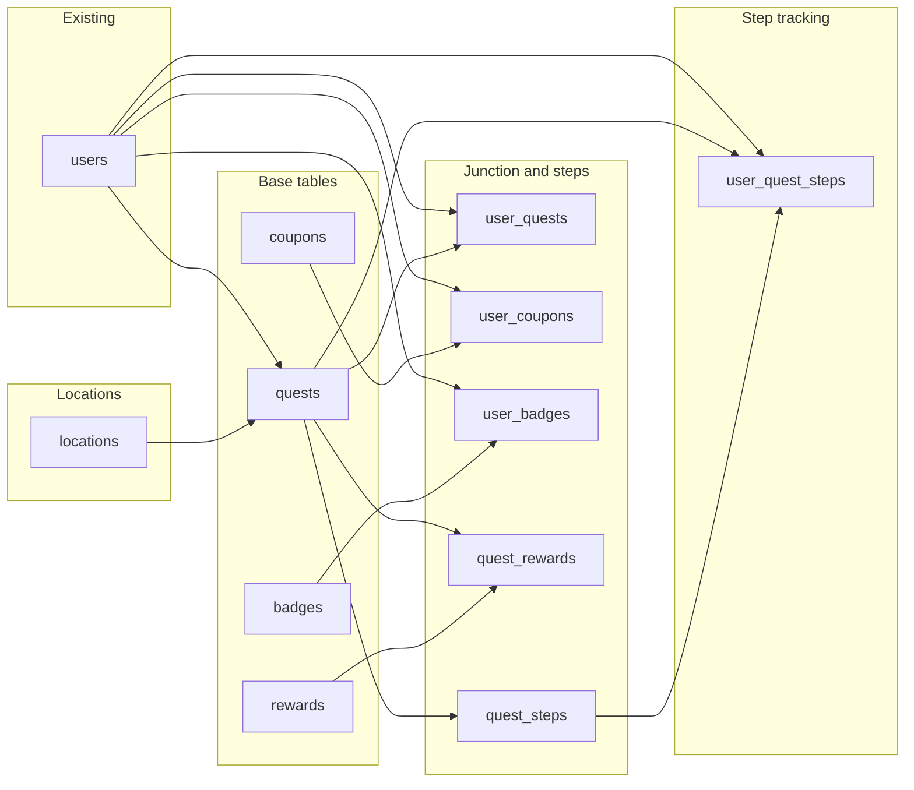

# Create migrations for gamification tables (with Locations)

## Important details: users and locations

- **Users:** The app’s users table is in [database/migrations/0001_01_01_000000_create_users_table.php](z:\School\XAMPP\htdocs\CampusGoWeb\database\migrations\0001_01_01_000000_create_users_table.php) and uses `**id`** as the primary key (not `user_id`). All FKs to “the user” must reference `**users.id`**; in child tables use `user_id` or `created_by_user_id` as the column name.
- **Locations:** Create the `**locations`** table **before** `quests`. Quests has `location_id` referencing **Locations** (not Users). In your SQL you had `FOREIGN KEY (location_id) REFERENCES Users(location_id)` — that is a typo: it must be `REFERENCES Locations(location_id)`.

## Dependency order (include Locations)

Create migrations in this order so every referenced table exists first:

**Concrete order for migrations:**

1. **Locations (no FK to other new tables):** `locations`
2. **Base tables:** `quests` (FKs: `created_by_user_id` → users, `location_id` → locations), `coupons`, `badges`, `rewards`
3. **User–entity and quest–reward links:** `user_quests`, `user_coupons`, `user_badges`, `quest_rewards`, `quest_steps`
4. **Step tracking:** `user_quest_steps`

You can do this in **one migration file** that creates all tables in that order, or **several migrations** (e.g. one per table or one per “layer”). One file per table is often easier to maintain and to roll back selectively.

## Table naming and primary keys

- Use **Laravel convention:** table names **snake_case plural** (`locations`, `quests`, `coupons`, `badges`, `rewards`, `user_quests`, `user_coupons`, `user_badges`, `quest_rewards`, `quest_steps`, `user_quest_steps`).
- Use `**id`** as the primary key for every new table (`$table->id()`), so Eloquent works out of the box. Your SQL uses `quest_id`, `location_id`, etc.; in Laravel the column is typically just `id` unless you have a strong reason to keep the old names. If you keep custom names, set `$primaryKey` (and optionally `$keyType`) on each model.

## Mapping your SQL to Laravel migrations

| Your column / type                    | Laravel migration                                                                                                                   |
| ------------------------------------- | ----------------------------------------------------------------------------------------------------------------------------------- |
| `*_id INT AUTO_INCREMENT PRIMARY KEY` | `$table->id()`                                                                                                                      |
| `VARCHAR(255)`                        | `$table->string('name', 255)` or `$table->string('name')`                                                                           |
| `TEXT`                                | `$table->text('description')`                                                                                                       |
| `ENUM('a','b','c')`                   | `$table->enum('quest_type', ['daily','event','task'])`                                                                              |
| `TIMESTAMP` / `created_at`            | `$table->timestamp('created_at')->nullable()` or `$table->timestamps()`                                                             |
| `BOOLEAN`                             | `$table->boolean('is_repeatable')->default(false)`                                                                                  |
| `INT` (e.g. quantity, amount)         | `$table->unsignedInteger('quantity')->nullable()`                                                                                   |
| `DECIMAL(10,8)` / `DECIMAL(11,8)`     | `$table->decimal('latitude', 10, 8)` / `$table->decimal('longitude', 11, 8)`                                                        |
| FK to Users                           | `$table->foreignId('user_id')->constrained('users')` or `$table->foreignId('created_by_user_id')->nullable()->constrained('users')` |
| FK to Locations                       | `$table->foreignId('location_id')->nullable()->constrained('locations')`                                                            |

**Locations table:** `name` (string 255), `description` (text nullable), `latitude` (decimal 10,8), `longitude` (decimal 11,8), `radius_meters` (unsignedInteger, default 20), `timestamps`.

**Quests:**  

- `created_by_user_id` → `$table->foreignId('created_by_user_id')->nullable()->constrained('users')` (references `users.id`).
- `location_id` → `$table->foreignId('location_id')->nullable()->constrained('locations')` (references `locations.id`; **not** Users).

**Pivot `QuestRewards`:**  

- Use `$table->foreignId('quest_id')->constrained()->cascadeOnDelete()` and `$table->foreignId('reward_id')->constrained()->cascadeOnDelete()`, then `$table->primary(['quest_id', 'reward_id'])`.

**Optional fields:**  

- Include `is_repeatable` and `difficulty` on `quests`; `is_scalable` on `rewards` as in your SQL.

## Suggested “first step” scope

**Option A (single migration):**  
Create one migration that creates, in order: `locations`, `quests`, `coupons`, `badges`, `rewards`, `user_quests`, `user_coupons`, `user_badges`, `quest_rewards`, `quest_steps`, `user_quest_steps`, with all columns and foreign keys as above (including `quests.location_id` → `locations.id`). Run `php artisan migrate` once.

**Option B (one migration per table):**  
Create separate migrations, e.g. `create_locations_table`, `create_quests_table`, `create_coupons_table`, …, `create_user_quest_steps_table`, with filenames/dates in the same dependency order so FKs never reference missing tables.

After migrations run, add Eloquent models (including `Location`), set relationships, then add API or web routes and controllers that use these tables.